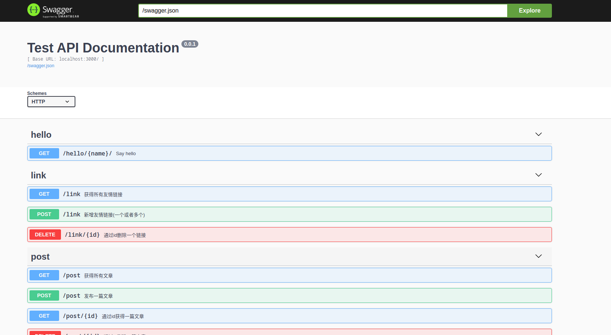
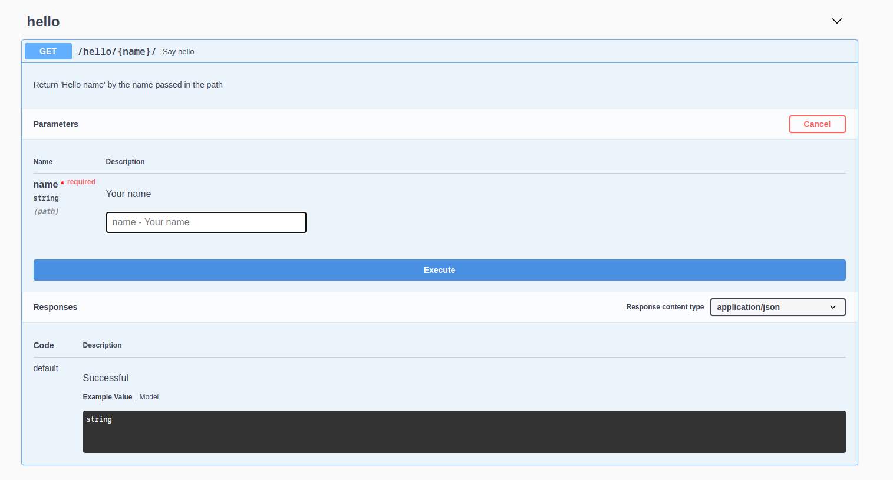
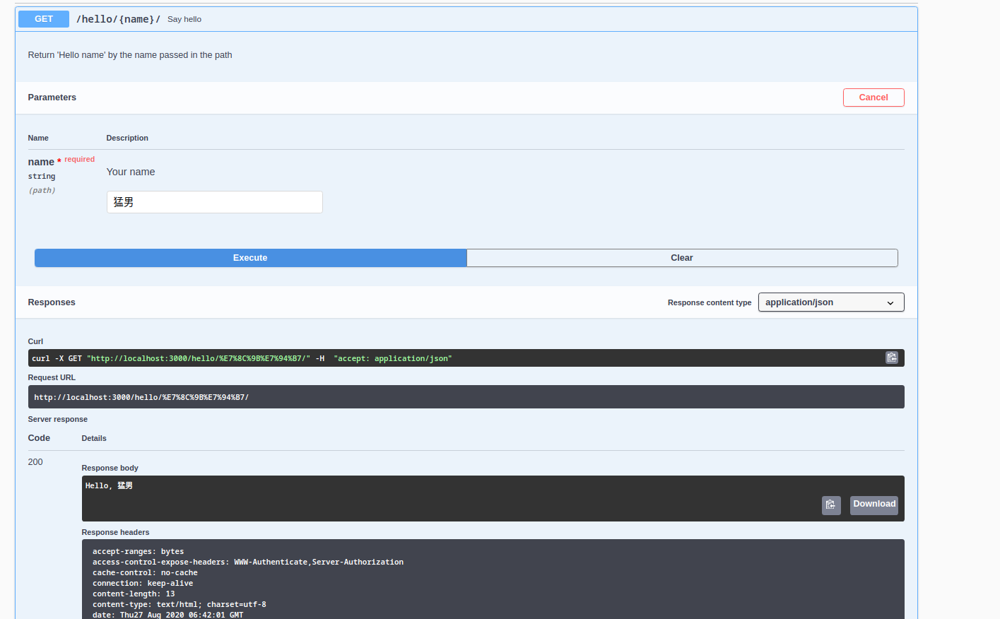

# backend-service

成都大学计算机学院官网后台

所使用技术：

- 使用 typescript 作为编码语言
- 使用 Hapi.js 提供 Web 服务
- 使用 mongoose 和@typegoose/typegoose 提供 ODM 服务
- 使用 Mongodb 提供数据存储服务
- 使用 swagger 提供接口信息
- 使用 editorconfig，prettier，eslint 的 airbub 配置规范代码；
- 使用 docker, docker-compose 提供容器化服务

## 预览

Swagger 页面 -- http://localhost:3000/documentation

<!-- TODO: 添加动态图片 -->





## 如何使用

这是一个提供 API 的服务器，`/documentation` 为 swagger 文档地址

，`/api` 为各种 api 的地址//todo

## Get Start

### Run With Docker

最简单的方式是直接通过 Docker 运行

首先运行之前你需要安装 docker，docker-compose，然后运行 `docker-compose up -d` 即可

### Run on Windows

#### 准备工作

要想直接在 windows 上运行，你需要先安装以下包：

- [Node.js](http://nodejs.cn/download/)
- yarn

  ```sh
  # 如果是 linux 环境安装失败可以在前面加一个 sudo
  # 如果是 windows 环境安装失败则使用 管理员身份打开powershell 打开
  npm i -g yarn
  ```

- [Mongodb](https://www.mongodb.com/try/download/community)
- [Vscode(推荐)](https://code.visualstudio.com/)
- 如果使用 Vscode，需要安装以下插件：
  - EditorConfig for VS Code
  - Prettier - Code formatter
  - Eslint

#### Running

在启动之前，我们需要将 mock 数据导入 Mongodb 中：

<!-- TODO: 使用ps1脚本一键导入 -->

```sh
mongo localhost:27017/test ./mongodb/init/articles.js
```

接下来安装所需要的依赖：

```sh
# develop
# 如果你想修改代码，就运行下面这个
yarn

# product
# 如果你是想快速启动服务器，运行这个
yarn --prod
```

开始运行

```sh
yarn start

# 检测文件变化
yarn dev
```

## 附录

### 安装 Nodejs

### 安装 yarn

如果为 windows 平台，需要以管理员身份打开 powershell，然后使用`npm i -g yarn`安装 yarn；

如果是 linux 分发包，使用`sudo npm i -g yarn`安装 yarn；

如果使用 nvm 安装的 Node.js，使用`npm i -g yarn`安装 yarn

1. windows

   以管理员身份打开 powershell，使用`npm i -g yarn`安装

2. windows with nvm

   打开 powershell，使用`npm i -g yarn` 安装

3. linux

   打开终端，使用`sudo npm i -g yarn`安装

4. linux with nvm

   打开终端，使用`npm i -g yarn`安装

### 换源

```sh
# yarn换源
yarn config set registry https://registry.npm.taobao.org/

# npm
# 在本地用户目录下新建一个`.npmrc`文件，里面添加
registry=https://registry.npm.taobao.org/

```

### 安装`Mongodb`
