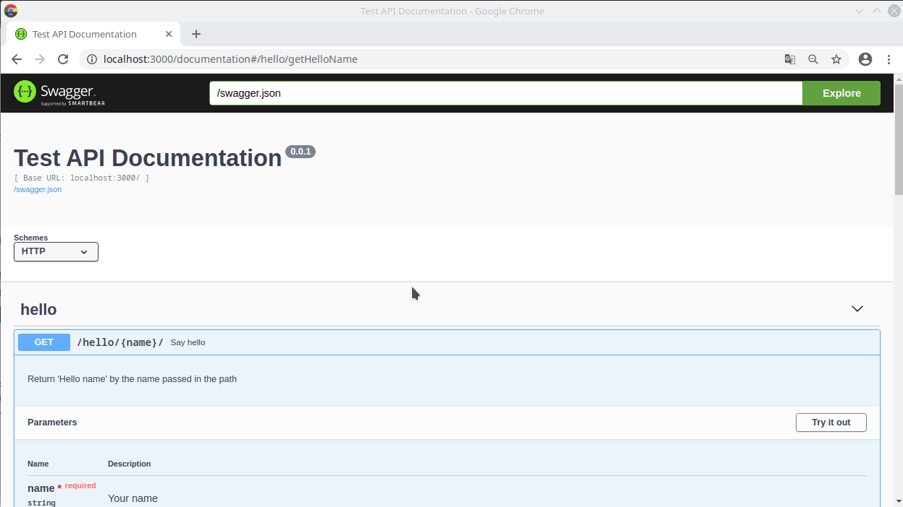

# backend-service

成都大学计算机学院官网后台

所使用技术：

- 使用 typescript 作为编码语言
- 使用 Hapi.js 提供 Web 服务
- 使用 mongoose 和@typegoose/typegoose 提供 ODM 服务
- 使用 Mongodb 提供数据存储服务
- 使用 swagger 提供接口信息
- 使用 editorconfig，prettier，eslint 的 airbub 配置规范代码；
- 使用 docker, docker-compose 提供容器化服务

## 预览



## 如何使用

这是一个提供 API 的服务器，`/documentation` 为 swagger 文档地址, 默认端口为 3000, 具体的 api 地址可以在文档页查看

## Get Start

### Run With Docker

1. 最简单的方法

   安装 docker，docker-compose，然后运行 `docker-compose up -d` 即可，接下来，你可以直接访问 [swagger 页面](http://localhost:3000/documention)

### Run on localhost

要想直接在 windows 上运行，你需要先安装以下包：

- Node.js
- yarn
- Mongodb
- Vscode
- 如果使用 Vscode，安装以下插件获得完整开发体验：
  - EditorConfig for VS Code
  - Prettier - Code formatter
  - Eslint
  - Todo Tree

在启动之前，我们需要将 mock 数据导入 Mongodb 中, 在 mongodb 目录有 init 脚本，以 ps1 结尾的为 windows 脚本，sh 结尾的为 linux 脚本。

```sh
mongodb
├── Dockerfile
├── init
├── init.ps1
├── init.sh
└── start-docker.sh
```

使用 `yarn` 安装依赖

使用 `yarn dev` 运行

## 附录

### 安装 Nodejs

### 安装 yarn

### 换源

```sh
# yarn换源
yarn config set registry https://registry.npm.taobao.org/

# npm
# 在本地用户目录下新建一个`.npmrc`文件，里面添加
registry=https://registry.npm.taobao.org/
```

### 安装 Mongodb

## contribution

```sh
├── image
│   └── swagger-demo.gif
├── mongodb
│   ├── init # mock 数据，生成docker镜像时需要
│   ├── Dockerfile
│   ├── init.ps1 # 在本地mongo服务器初始化时使用init脚本
│   ├── init.sh
│   └── start-docker.sh
├── src
│   ├── models # ODM 模型
│   ├── routes # 路由
│   ├── config.ts # 配置服务
│   ├── index.ts # 入口
│   └── mongoose.service.ts # 数据库服务
├── docker-compose.yml
├── Dockerfile
├── LICENSE
├── package.json
├── README.md
└── tsconfig.json
```

## 联系我们

我们是成都大学计算机学院的一群学生，希望为这个项目作贡献的话就来加入我们吧。

- QQ: 1481220484
- WX: hanhan9449
